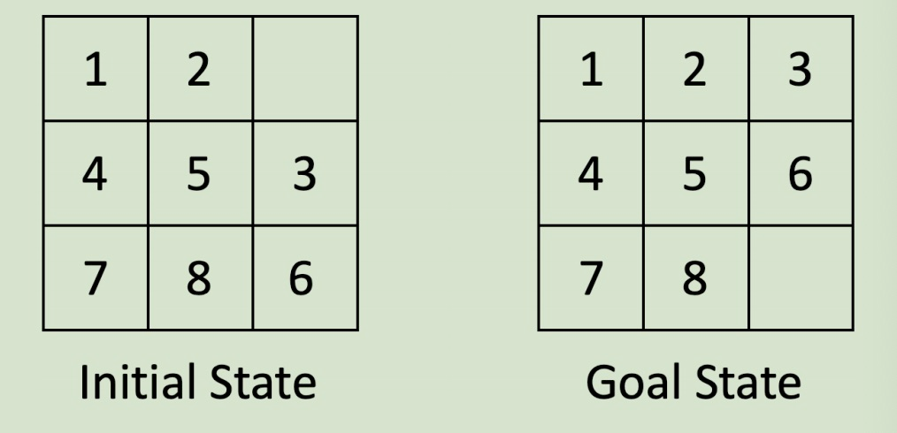

PDR: Laboratory 11: Graphs
==========================

[Go up to the Labs table of contents page](../index.html)

### Objective ###

To become familiar with representing graphs in general, directed acyclic graphs (DAGs), topological sorting, traveling salesperson problem, and other related algorithms.


### Background ###

A graph is a set of vertices connected by edges.  In a directed graph, an edge is an ordered pair of vertices, where you can follow an edge from one vertex to another.  In a directed acyclic graph (DAG), no path starts and ends at the same vertex.  A topological sort orders the vertices in a DAG such that any edge from vertex i to vertex j satisfies i < j.

### Tutorial ###

Go through the [Doxygen tutorial](../../tutorials/11-doxygen/index.html), which is a program that allows you to generate documentation for your code.

### Recommended Readings ###

1. The [Wikipedia page on Topological sort](https://en.wikipedia.org/wiki/Topological_sorting)
2. The [Wikipedia page on the Traveling Salesperson problem](https://en.wikipedia.org/wiki/Travelling_salesman_problem)
3. [The slides on graphs](../../slides/11-graphs.html)

Procedure
---------

### Pre-lab ###

1. Understand and document the [middleearth.h](middleearth.h.html) ([src](middleearth.h)) and [middleearth.cpp](middleearth.cpp.html) ([src](middleearth.cpp)) files
2. Write a program to compute a topological sort of a graph
3. Document your topological.cpp with doxygen comments
4. Write a Makefile to compile your code and generate documentation
5. Files to download: [prelab-test-full.txt](prelab-test-full.txt), [prelab-test-small.txt](prelab-test-small.txt), [middleearth.h](middleearth.h.html) ([src](middleearth.h)), [middleearth.cpp](middleearth.cpp.html) ([src](middleearth.cpp)), [fileio2.cpp](fileio2.cpp.html) ([src](fileio2.cpp))
6. Files to submit: topological.cpp, middleearth.h/cpp, Makefile, Doxyfile

### In-lab ###

1. Implement a brute-force traveling salesperson solution
2. Document your C++ files with doxygen commands
3. Write a Makefile to compile your code and generate documentation
4. Files to download: [traveling-skeleton.cpp](traveling-skeleton.cpp.html) ([src](traveling-skeleton.cpp)) (which you'll have to rename to traveling.cpp), and your commented middleearth.h / middleearth.cpp code from the pre-lab
5. Files to submit: traveling.cpp, middleearth.h, middleearth.cpp, Makefile, Doxyfile

### Post-lab ###

The post-lab is cancelled for the spring 2021 semester.

1. ~~Write an 8-Puzzle solver using BFS~~
2. ~~Files to download: none~~
3. ~~Files to submit: Makefile, Doxyfile, and any source code required to run the solver.~~

------------------------------------------------------------

Pre-lab
-------

### Good code documentation ###

For this lab, any code you submit must be properly documented using doxygen.\
This includes the [middleearth.h](middleearth.h.html) ([src](middleearth.h)) and [middleearth.cpp](middleearth.cpp.html) ([src](middleearth.cpp)) files, which you should understand and document as part of the pre-lab.

There are many doxygen commands, and we expect for you to use more than just those that were provided in the tutorial. **Specifically, the grader will look that you've incorporated at least two additional doxygen tags that are NOT in the tutorial.**

### Topological sort ###

Recall from lecture that given a graph *G* = (*V*,*E*), a topological sort of a directed acyclic graph is a linear listing of the vertices such that, for all pairs of vertices *v*,*w* &isin; *V*, *v* is listed before *w* in the topological sort if (*v*,*w*) &isin; *E* (i.e. if there is an edge from *v* to *w* in the graph, then *v* must be listed before *w* in the topological sort).  This implies that if there is a *path* from *v* to *w* (not just an edge), then *v* must still list before *w* in the topological sort.

For the programming part of this lab, you will need to write a program that can perform a topological sort.  This problem is specified in the next section.  The specification is similar to that found in the [International Collegiate Programming Contests](https://icpc.baylor.edu/) -- a problem description, followed by a detailed explanation of the input and the output.

How you represent your graph is up to you -- choices include: node-with-pointers, adjacency list, adjacency matrix, and others.  Just keep in mind that you will have to do a topological sort on this graph.  The program must read in a list of directed edges from a file and (internally) generate the graph from it.

To read in strings from a file in the C++ manner, see the [fileio2.cpp](fileio2.cpp.html) ([src](fileio2.cpp)) file.

### Makefile ###

The first target in your Makefile can be named anything you want, but should do **two** things: compile your code, and run doxygen.  You can have two tabbed lines after the target specifier, which is the easiest way to accomplish this.  In other words, we are just going to call `make`, and we want it to both compile your code and create your doxygen documentation.  You are welcome to have additional targets, such as `clean`, if you would like.

------------------------------------------------------------

Pre-lab Problem: Topological Sort
---------------------------------

It turns out that one of our teaching assistants did not take all of the pre-requisite computer science courses!  That TA is all ready to graduate, but it turns that CS 1110 was never taken.  The department came down hard, and decided to make that TA take all of the courses over again, to have the proper pre-requisite classes completed for each successive class.  But the TA just got a job at Microsoft, and can only take one course a semester while working full time.  In what order should the teaching assistant take the list of required courses to properly fulfill the pre-requisites this time around?

Given the following course pre-requisite graph:


There are multiple valid orders that the courses can be taken in; each is a valid topological sort:

- cs1110 cs2110 cs2102 cs3330 cs2150 cs4414
- cs1110 cs2110 cs2102 cs2150 cs3330 cs4414
- cs1110 cs2102 cs2110 cs3330 cs2150 cs4414
- cs1110 cs2102 cs2110 cs2150 cs3330 cs4414
- cs1110 cs2110 cs3330 cs2102 cs2150 cs4414

For this lab, you can print out **ANY** valid topological sort for credit.


### Input ###

The program will consist of a single file, `topological.cpp`, and take a single command-line parameter.  This parameter will specify the file name that contains the input.

The input file will consist of a series of lines that each designate a directed edge.  Each line will have two vertex names, separated by a single space; the edge is directed from the first to the second listed vertex name on a given line.  Every vertex name is a series of alphanumeric characters only (a-z, A-Z, 0-9) without any spaces or punctuation.  Note that case is relevant, so vertex `abc` is distinct from vertex `ABC`.  The edges can be listed in any order.

The end of the input file is signified by two 0s on the same line, separated by a single space.

You can assume that the provided graph is a directed acyclic graph, that it is weakly connected, and thus that there is at least one valid topological sort.  You can further assume that there will not be more than 100 vertices in the graph.

### Output ###

The output is a valid topological sort of the vertices, each separated by one space, and all on one line.  

### Sample Execution Run ###

Below is a sample execution run to show you the input and output format we are looking for.

Given the input file:

```
cs2110 cs2150
cs2102 cs2150
cs1110 cs2110
cs3330 cs4414
cs2150 cs4414
cs2110 cs3330
cs1110 cs2102
0 0
```

Output (*NOTE: This is just one of many valid topological sorts*):

```
cs1110 cs2102 cs2110 cs2150 cs3330 cs4414
```

------------------------------------------------------------

In-lab
------

### The Traveling Salesperson ###

You are going to implement a program that will find a solution to the [traveling salesperson problem](https://www-e.ovgu.de/mertens/TSP/TSP.html).  This problem is known to be [NP-complete](https://en.wikipedia.org/wiki/NP-completeness), which means that there is no known efficient solution to the problem.  Thus, we will be implementing a rather inefficient solution -- a brute-force method that tries every possible path combination.

The traveling salesperson problem is as described in lecture.  In brief, you start from a given city (your "home" city), and have to travel to a number of other cities before returning home.  There is a fixed cost between any two cities (miles traveled, dollars spent, time taken, etc).  The goal of this algorithm is to find the least costly path that travels to each of the cities, in any order.

The world we have chosen is [Middle-Earth](https://en.wikipedia.org/wiki/Middle-earth), the location of J.R.R. Tolkien's Hobbit and Lord of the Rings books and movies.  The middleearth.h and middleearth.cpp files contain a class that will create a random 2-dimensional world.  The "randomness" means that it will pick a given number of cities (or places), and randomly place them in the "world".  You can travel from any city to any other city, for a given cost (the distance).  The city names are all from the books and movies, and can be seen at the beginning of the middleearth.cpp file -- there is a textual description in the code as to what all the places are.  The randomness of the world means that cities that are nowhere near each other in the books/movies might be right next to each other in the random world.

When your program is completed, you will need to specify five command-line parameters to execute the traveling salesperson problem.  The parameters are, in order:

1. The x-size (i.e. width) of the world.  We'll use 20 throughout this lab.
1. The y-size (i.e. height) of the world.  We'll use 20 throughout this lab.
1. The number of cities in the world.  There are currently 40 names specified at the top of middleearth.cpp, so you can't specify more than 40 cities.
1. The random seed.  If you specify a given number, the same world will be created each time -- we'll use this, below, when we talk about debugging.  Supplying -1 will create a different random world each time the program is run.
1. The number of cities to visit, other than the "home" city -- this can be as low as 1.

The skeleton code provided ([traveling-skeleton.cpp](traveling-skeleton.cpp.html) ([src](traveling-skeleton.cpp))) already parses the command-line parameters properly.

### STL Helper Functions ###

There are a number of STL functions that will help you in writing this program.  All of these algorithms (and more!) are provided in the `<algorithm>` header file.  This file is already included by traveling-skeleton.cpp.

First, take a look at the `shuffle()` method in middleearth.cpp:

```
shuffle(cities.begin(), cities.end(), gen);
```

This method takes a vector and a random number generator, and will randomly shuffle the vector, similar to Java's `Collections.shuffle()`.  The parameters specify the amount of the vector that we want to shuffle.  Because we want to shuffle the entire vector, we specify the beginning and end of the list.
We define our own custom `shuffle` implementation rather than using the STL's to provide the same results regardless of what OS you are using.

The `sort()` method takes in vector iterators as well, and sorts the list.  It is similar to Java's `Collections.sort()` method.  It returns no value.

The `next_permutation()` method will cycle through each and every permutation of the passed vector.  ***It must start out with a sorted vector***, and will move through each and every possible list ordering until the vector ends up in reverse sorted order.  It takes the same parameters as `sort()`.  Note that it does not return a new permutation, but instead modifies the vector that is passed in.  It returns `true` if it found another permutation and `false` if there are no more permutations to provide.  Thus, it is often put into a do-while loop.  For an example of using `next_permutation()` in a while loop, see [here](https://en.cppreference.com/w/cpp/algorithm/next_permutation).  This is a good way to iterate through each possible combination of cities to travel to.

### Middle-Earth methods ###

The MiddleEarth class provides a number of methods to help you write your brute-force solution.  The constructor is called by the skeleton code, and uses the parameters read in from the command line.  The `print()` method will print out statistics of the world.

The `printTable()` method will print out a table of the distances between all cities.  Different random seeds will produce different tables, obviously.  This will be useful to help you debug your program.  Redirect it to a file, and then load it up in a spreadsheet program.

The `getDistance()` method will return the distance, as a float, between the two provided cities.  In an effort to make your code as efficient as possible, `getDistance()` has the same expected running time as a hash table.  Lastly, `getItinerary()` will return a vector of the cities that you must visit.  The first city provided is the start (and thus end) city -- you should remove this from the vector before you consider all possible cycles through the graph.

### How to proceed ###

We provide the skeleton code for the algorithm -- your job is to complete traveling.cpp.

1. First complete `printRoute()`, as that will be useful when debugging your code.  It should print a route in the form: `Gladden Fields -> Bywater -> Dagorlad -> Pelennor Fields -> Cirith Ungol -> Gladden Fields`.  Note that we aren't picky about exactly how it's printed, as long as it prints all the cities.
2. Next, complete `computeDistance()`.  You can create a sample string vector to test it, and verify it against the distances in the output of `printTable()`.
3. Start on the `main()` method.  Make sure that you can print out all the permutations of the list of destinations.  Note that for n cities, there are n! possible permutations.  Remember that the start city should not be permuted!
4. At this point, you can now compute the distance and keep track of the minimum cycle length.

Your final program should should print out the shortest path as the last thing printed.  You can print out multiple paths as you find the shortest one, but you should **NOT** print out _every_ path you try.

Note that you are determining a cycle of cities to visit.  So if your cycle has the cities in reverse, then it's still a valid solution.

### Getting your itinerary correct ###

The starting city is **not to be permuted**, as you will always start (and end) at that city.  It's the *other* cities that are going to be permuted through the calls to `next_permutation()`.

### Timing your code ###

Keep in mind that as you increase the size of the city tour, the running time increases exponentially.  Modern-day computers can probably compute about 200,000 routes per second (with well written and optimized code).  Our 10-route cycle took 18 seconds.  A 15 route cycle would take 2.5 months.  A 20 route cycle would take 385,734 years!  Realistically, you shouldn't be trying anything with an itinerary greater than 9 or 10.

And when you are planning on testing long paths, you should really compile your code with the `-O2` compiler option.  It can speed up the program by a factor of two.  

To time your code, enter `time` before the command on the command-line.  For example:

```
student@cassiopeia:~/labs/lab11$ time ./a.out 20 20 20 14 8
./a.out 20 20 20 14 8
Minimum path has distance 62.9931: Barad-Dur -> Helm's Deep -> Minas Tirith -> The Old Forest -> Dagorlad ->
                                   Dunharrow -> Rivendell -> Entwash River -> Trollshaws -> Barad-Dur

real    0m0.105s
user    0m0.076s
sys     0m0.020s
student@cassiopeia:~/labs/lab11$ 
```

The time we are looking at is the "user" time; this is how long it took to run the user's program.  The "sys" line is how much time the system was doing things during the program execution, such as I/O.  The "real" time is the "wall time" -- meaning if you had a stop watch, it would report the "real" time.  The "real" time includes many other things, such as other tasks you are doing on the computer -- if you have an animation running in a web browser, for example, it will increase the "real" time, as the system is spending some effort rendering those animations.  We'll only use the "user" time for this lab.

### Sample output ###

For this lab, we will keep the size of the 2-D world fixed at (20,20).  These are the first two command line parameters.  We'll also create a world of 20 cities (chosen from the 40 names in middleearth.cpp) -- this is the third command line parameter.

If the random seed (the fourth parameter) is 14, then the path lengths and paths for the various itinerary lengths are listed below.  Because we are explicitly setting the random seed, it should produce the exact same results each time -- and thus your code should also produce the same results.

The results for a random seed of 14, world size of 20x20 with 20 cities, and various path lengths:

1. Minimum path has distance 19.2463: Barad-Dur -> Trollshaws -> Barad-Dur
2. Minimum path has distance 47.0356: Barad-Dur -> Dagorlad -> Trollshaws -> Barad-Dur
3. Minimum path has distance 47.73: Barad-Dur -> Helm's Deep -> Dagorlad -> Trollshaws -> Barad-Dur
4. Minimum path has distance 61.1471: Barad-Dur -> Helm's Deep -> Dagorlad -> Entwash River -> Trollshaws -> Barad-Dur
5. Minimum path has distance 61.1496: Barad-Dur -> Helm's Deep -> The Old Forest -> Dagorlad -> Entwash River -> Trollshaws -> Barad-Dur
6. Minimum path has distance 62.0552: Barad-Dur -> Helm's Deep -> The Old Forest -> Dagorlad -> Dunharrow -> Entwash River -> Trollshaws -> Barad-Dur
7. Minimum path has distance 62.2792: Barad-Dur -> Helm's Deep -> The Old Forest -> Dagorlad -> Dunharrow -> Rivendell -> Entwash River -> Trollshaws -> Barad-Dur
8. Minimum path has distance 62.9931: Barad-Dur -> Helm's Deep -> Minas Tirith -> The Old Forest -> Dagorlad -> Dunharrow -> Rivendell -> Entwash River -> Trollshaws -> Barad-Dur
9. Minimum path has distance 71.335: Barad-Dur -> Helm's Deep -> Emyn Muil -> Dagorlad -> Dunharrow -> Rivendell -> Entwash River -> Trollshaws -> The Old Forest -> Minas Tirith -> Barad-Dur
10. Minimum path has distance 72.0124: Barad-Dur -> Helm's Deep -> Emyn Muil -> Dagorlad -> Dunharrow -> Misty Mountains -> Rivendell -> Entwash River -> Trollshaws -> The Old Forest -> Minas Tirith -> Barad-Dur

Your final program needs to both be able to compile and run with the specified command-line parameters.

### Makefile ###

Your Makefile should have **only one** target, which you can name anything you want.  This target should do **two** things: compile your code, and run doxygen.  You can have two tabbed lines after the target specifier, which is the easiest way to accomplish this.  In other words, we are just going to call `make`, and we want it to both compile your code and create your doxygen documentation.  The in-lab Makefile should have the same dual-purpose target.

------------------------------------------------------------

Post-lab
--------

The post-lab is cancelled for the spring 2021 semester.

~~Consider the [Sliding 8-Puzzle](https://en.wikipedia.org/wiki/15_puzzle) game, depicted in the image below. If you'd like, you can play the puzzle [HERE](http://www.artbylogic.com/puzzles/numSlider/numberShuffle.htm?rows=3&cols=3&sqr=1) to get a better sense for how the game works.~~



~~In this 3x3 grid of numbers, the goal is to slide numbers into the empty square until the end game state is reached. As can be seen above, our end game state is a sorted board. The hole in the board can move in any direction, but cannot "wrap around" from one side to the other (or from top to bottom, etc.).~~

~~Your task for this lab is to implement a solution to the 8 puzzle problem described above: given an input board, find the minimum number of moves required to reach the end state, or if it is impossible to reach it.~~

### ~~Storing the Puzzle~~ ###

~~The simplest way to store the puzzle would be with either a 1D or 2D array, where the hole is represented by a 0 (zero). Then, if you wanted to move the hole around the "board", you would simply swap its position in the array with an adjacent tile. Consider making an object (or struct) that stores a single configuration of the board.~~

### ~~Solving the Puzzle~~ ###

~~Once you have an object for storing a single configuration of the puzzle, you can start thinking about this as a graph problem. Consider each unique configuration (one instance of your object) to be a node in the graph. There exists an edge between two configurations in the graph if you can reach configuration *B* from configuration *A* by only sliding one tile.~~

~~Once you have represented this problem as a start state (input that is given to you) and goal state (the final solved puzzle) with edges (moves) in between, you can solve this problem by finding the **shortest path** between the start state and the solved state. Use one of the algorithms from class to find the shortest path. You should probably choose **breadth-first search**...you can use *Dijkstra's Algorithm*, but because edge weights are all *1* here, it is pointless to add the extra complexity.~~


### ~~Testing for Solvability~~ ###

~~If your search algorithm goes through all configurations of the possible without ever reaching the goal state, than that starting configuration is impossible to solve.~~

~~There is an easy way to check if an 8-puzzle is solvable or not by using inversions. An inversion is a pair of tiles that are in reverse order to their appearance in the goal state. If an 8-puzzle has an **even** number of inversions, then the puzzle is **solvable**. If an 8-puzzle has an **odd** number of inversions, then the puzzle is **unsolvable**.  For example, the following 8-puzzle has 3 inversions, and is thus impossible to solve. You can watch [this video](https://www.youtube.com/watch?v=YI1WqYKHi78) for a slightly more detailed description if you are interested.~~

~~Another, but less elegant, way of testing for impossibility~~

```
2 1 3
4 0 5
8 6 7
```

~~The inversions in this example are (2,1), (8,6), and (8,7).~~

### ~~Input~~ ###

~~The input to this program will be three lines of three numbers, each representing a tile of the 8-puzzle.~~

### ~~Sample Execution Run~~ ###

~~Below is a sample execution run to show you the input and output format we are looking for.~~

```
Enter puzzle
3 6 4
1 2 5
7 8 0
Solving puzzle
18
```

~~Here is another example showing how your output should look for an impossible puzzle.~~

```
Enter puzzle
2 1 3
4 0 5
8 6 7
Solving puzzle
IMPOSSIBLE
```

### ~~Submission~~ ###

~~You should submit any files required for your 8 puzzle solver to run as well as a Makefile that prodcues an `a.out` executable.~~

### ~~Makefile~~ ###

~~Your Makefile should have **only one** target, which you can name anything you want.  This target should do **two** things: compile your code, and run doxygen.  You can have two tabbed lines after the target specifier, which is the easiest way to accomplish this.  In other words, we are just going to call `make`, and we want it to both compile your code and create your doxygen documentation.  The post-lab Makefile should have the same dual-purpose target.~~

### ~~Hints~~ ###

#### ~~Where do I get Started?~~ ####

~~There are a lot of steps to this lab, and it is important to partition the work and only focus on one component at a time. Start out by working on how you will represent a puzzle: as a class, an array with helper methods, etc. Once you can read in a puzzle and manipulate it at will, you are ready to move on to the actual solving portion of the lab.~~

#### ~~Too Many Permutations! Which Ones Should I Look at First?~~ ####

~~There aren't **that** many permutations of this puzzle (there are 9! = 362,880). However, it is beneficial to only create / store the nodes that you are actually using as you go. For example: suppose I have the following starting grid:~~

```
2 1 0
4 3 5
8 6 7
```

~~When the code begins, this will be the **only** node in the graph. As I begin my breadth-first search, we can generate neighboring nodes on the fly. For example, when I do the next step of search, I can call a method called *generateNeighbors()*, that given the node above as input, returns the following states that can be reached by a single move (sliding the 1 to the right or sliding the 5 up):~~

```
2 0 1		2 1 5
4 3 5		4 3 0
8 6 7		8 6 7
```

~~Now, my graph has 3 total nodes. As I continue my search, I can do the following: for a given node I'm searching, generate the neighbors of that node, check if the neighbor has already been search (a hash table is useful here). If the neighbor has already been searched, discard it (don't want to duplicate work over and over). If it has not been seen, add it to my BFS queue and continue.~~

~~Good luck!!~~
