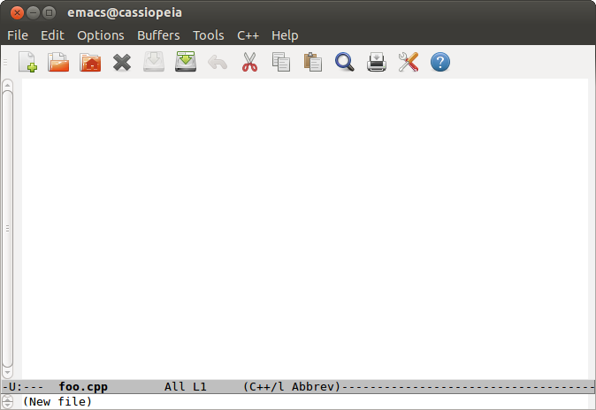
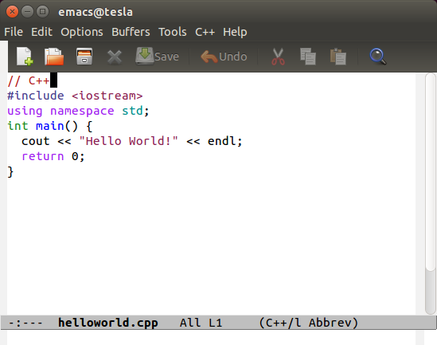
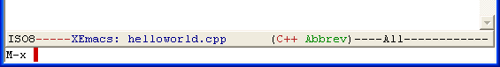

PDR: Tutorial 1: Introduction to UNIX
=====================================

[Go up to the Tutorials table of contents page](../index.html)

Part I: Introduction and setting up your UNIX environment
---------------------------------------------------------

This tutorial is meant to get you up and running with editing, compiling, and executing a program in a Unix-like environment.  There are a number of options that you can use to do this, depending on what operating system you are using and how much time you want to spend installing software.

We recommended using VirtualBox, a free virtual machine software package.  This will allow you to run Linux on your home machine without needing to re-install anything.  Directions for setting up and how to use VirtualBox can be found at [Tutorial 1: Introduction to UNIX: VirtualBox use](virtual-box.html).  This will require downloading a hard drive image that we provide.

There are other options available:

- macOS users are already running UNIX, as macOS runs on top of FreeBSD (a version of UNIX).  So you can just use the computer you have.  HOWEVER, note that you still can't use an IDE (Eclipse, Xcode, etc.).  You can download Emacs (an editor) from [here](http://emacsformacosx.com/).  From a terminal window, try typing in `clang++ --version` - if you get "Command not found", you will need to install Xcode from the App Store, and then install the Command Line Tools (under Preferences - Downloads).  In newer versions of macOS, after typing `clang++ --version`, a pop-up should appear asking if you would like to install command line developer tools.  Also note that you cannot load up Emacs easily from a command line, but you can load it up as you would any other application.
    - You will need to install Xcode and the command line tools (with the latest version of Xcode, you have to download and install the command-line tools separately)
    - Note that some software that you will need for this course (in particular, doxygen and x86 code creation) does NOT work well on a Mac, and you will likely need the VirtualBox image for that
- Install a Unix variant on your home machine.  There are a number of options: Linux, FreeBSD, Solaris, etc.  We use Linux (specifically, the Ubuntu distribution), as it has a large user community, both at the University and outside.  Thus, if you run into a problem, the course staff might be able to help you.  This will require repartitioning your hard drive, and thus there is a chance of data loss.  **THUS YOU NEED TO BACK UP YOUR DATA FIRST!!!** You will have to choose a distribution of Linux to install -- as mentioned above, we use Ubuntu.  You can find install guides on the web.  Be sure to install the development environments with Linux -- pretty much all of the required software will be included in that.
- Windows 10 users have WSL (short for Windows Subsystem for Linux) available, which adds an entirely terminal-based Linux environment directly within Windows, with some limitations.  You can follow the instructions to install WSL [here](https://docs.microsoft.com/en-us/windows/wsl/install-win10). **NOTE**: WSL is still an evolving technology, and thus some tools may not work as expected -- in particular, the lldb debugger will not work.  Course staff will be less able to assist you if you run into WSL-specific issues.

----

Part II: A Tale of Two GUIs
---------------------------

When you install Linux, there are a number of graphical user interfaces -- or window managers -- that one can use.  Think of how MS Windows is different than macOS, and you get the idea.  The one we are using is *Gnome*.  Gnome (pronounced guh-NOME) is a user interface that is specific to UNIX machines.  The interactions with the GUI are a bit different, but the same concepts.  One can interact with Gnome really quickly once one gets used to the new interface.  You can see a screen shot of it [here](https://149366088.v2.pressablecdn.com/wp-content/uploads/2018/04/ubuntu-1804-desktop-screenshot.jpg).

----

Part III: A (brief!) Unix tutorial
---------------------------------

Unix is a very powerful operating system that has been around, in one form or another, for almost 40 years.  The fact that it still exists attests to how powerful it can be for completing tasks on a computer.  The reason it is not more widely adopted is because it is not very easy to use or intuitive -- it was written by computer programmers for computer programmers.  While the people in this course are certainly capable of learning it, many people just want a computer to work, and to run an Office suite and a set of Internet programs such as a browser.  For those users, an easier to use operating system (such as Windows or macOS) is often better.  Unix is coming more into the mainstream lately with the increased popularity of Linux, as well as the fact that macOS is built upon a Unix operating system (FreeBSD, in particular).

The word "Unix" can mean any Unix-like operating system.  There are many available -- Linux, FreeBSD, Solaris, macOS, etc.  We will be using the word Unix in this class to mean whichever Unix-like environment we are using for this course.

A quick note: Unix IS CASE SENSITIVE.  Thus, foo, Foo, FOO, and FoO are all different, and allowable, file names.  This causes problems with Windows, which sees all those names as the same thing.  So be careful about your cases!

### Loading a terminal ###

First, you need to load up a terminal.  For those who have used the Windows command prompt, it is a somewhat similar interface.

- With VirtualBox and Gnome, it's an icon on the toolbar on the left-hand side of the desktop
- On macOS, open Spotlight and search for Terminal


### The Unix Tutorial ###

Here is a quick primer of basic Unix commands.  Try each of these out.  The idea is for you to be able to manipulate files and directories -- the full Unix tutorial starts next week.

- `ls` will show the contents of the current directory.  'ls' stands for 'list', but without the 'i' and the 't'.
- `cd pdr` will change to the `pdr` directory -- in other words, it changes the current working directory to whatever you specify.  You should notice the text at the beginning of the line change: the _prompt_ will help you keep track of which directory you are in.  To go up a directory, you can enter `cd ..` (notice the one space and then two periods).  Also, you can enter `cd -` to jump to the previous directory you were in (the Ctrl-Z of directory hopping).  Finally, typing `cd` with nothing after it will move you back to your home directory.
- You can make directories by `mkdir` and remove them by `rmdir`.  This is the same as creating a folder in Windows Explorer.  A directory that is not empty cannot be removed.  For now, we recommend that any directory names (or file names) only have letters, digits, or the underscore in their names (there are ways around that, but they are complicated).
- Remove individual files with `rm`.
- Once we start saving files, we will want them to be somewhere easily accessible from Windows.  With VirtualBox, the [Tutorial 1: Introduction to UNIX: VirtualBox use](virtual-box.html) page discusses how to transfer files back and forth to the virtual machine.

That's it for the Unix tutorial for now.  There are many further tutorials online, feel free to read those.  You can do all your editing in your desktop folder -- this way, if you want to rename or move your files, you can use Windows Explorer to do so (there are Unix ways to do it, and we'll get to those later).


----

Part IV: Editing, compiling, and running a C++ program
-------------------------------------------------------

First, you will need to open a terminal (as in the previous section), from which we will load up an editor.  We will be using the Emacs editor for all our examples, but you are welcome to use any editor that is not an integrated development environment (IDE).  Whatever you decide to use, know that you will be expected to be familiar with it! This includes keyboard shortcuts.

To load up the editor, enter `emacs &` into the terminal.  The ampersand (`&`) at the end is very imporant!  This tells the terminal to start the `emacs` process in the background, which means you can continue to use the terminal while emacs is open.

If you are using macOS, you can open Emacs from the Dock or Spotlight if the above instructions do not work.

You should now have Emacs loaded and running -- it should look something like the following.



All of the mouse commands in Emacs have keyboard shortcuts.  Eventually, you will want to learn the shortcuts, as they are much faster to enter once they are known.  To help you with getting used to them, we have provided the shortcuts for the commands below.

The first commands in Emacs that we will learn will use the control key (even on macOS!).  For example, the save command is listed as `C-x C-s`.  This means hit Control-x then Control-s.  We will be going over Emacs command in more detail later.  For now, remember that if you get stuck, hit `C-g` (Control-g) a few times, and that should un-stick it.

We recommend you create a new directory for the rest of this tutorial (`mkdir tutorial`).  `cd` into that directory.

Next, let's open up a new file.  To do that, go to File->Open (`C-x C-f`).  Enter the name of the file (`helloworld.cpp`).  Note that if the file does not exist, then it is created (thus, it is like File->New in other programs).  If the file does exist, it is opened (like File->Open in other programs).  Also note that in the lower part of the Emacs screen, it should now say "C++ Abbrev" -- this is the mode that Emacs is in.  The "C++ Abbrev" means that it is in C++ mode, which is what we want.

Enter the following program -- feel free to cut-and-paste (there is an 'Edit->Paste' menu entry, or `C-y`).  This is the same program found in the first set of slides.  What all this C++ code means, we'll get to later -- this tutorial is just for entering, compiling, and running the programs.

```
#include <iostream>
using namespace std;

int main () {
    cout << "Hello World!" << endl;
    return 0;
}
```

Save the file (File->Save or `C-x C-s`).  If you switch back to the shell, and do an `ls`, you should see that file listed.

Next, we need to compile that file.  To do so, switch to the shell, and enter the command: `clang++ helloworld.cpp`.  It will compile, and if successful, the command prompt will be displayed after a brief pause.  If there were errors, then the it will list them to the screen.

After a successful compilation, do an `ls` -- you will see a second file, called `a.out`.  This is the compiled version of that program.  To run it, enter `./a.out`.  Note the period and slash before the `a.out` -- why this is there (and how to get rid of it) we will see later in the semester.

Another useful command is the undo command: `C-_` (Control-underscore).

Right now your Emacs should look approximately like this (with the helloworld.cpp file loaded):



Now, let's turn on line numbers, which will be very helpful when debugging your code.  We've seen control commands (such as `C-x C-s` for saving a file).  Next up are commands called meta-commands, because they use the meta (or escape) key.  A meta-command looks like `M-x linum-mode`.  Thus, to enter the command, hit the escape key, RELEASE THE ESCAPE KEY, and hit `x`.  Note that with the control commands, you hold down the control key while pressing the other key -- with meta commands, you press and then release the escape key, and then hit `x`.  At that point, the bottom of your Emacs screen will look like the following:


 
Note the `M-x` at the bottom -- Emacs is ready to receive an 'extended' meta command.  Type in `linum-mode`, hit Enter, and the line number that the cursor is on will appear in the status bar at the bottom of the Emacs screen.  Note that it is going to be annoying to have to type all of that in each time.  This, if you hit the tab key after entering `line`, it will complete the rest of the command for you.  While this may seem like a lot of typing, once you get used to it, these commands can be entered significantly faster than the mouse clicks needed to do this in other editors.  There are ways you can have line numbers always displayed when you enter Emacs -- we'll get to these later in the semester.  Note that you can enter `M-x linum-mode` as many times as you want -- it will just toggle the display of the line numbers on and off.

## Summary

In summary, you should be familiar with the following Emacs commands:

- `C-x C-s`: Save the file
- `C-x C-f`: Open a file, or create a new file if the file name is not found
- `C-x C-c`: Exit Emacs (prompts to save the file if it is not saved)
- `C-g`: Stop the current command
- `C-_`: Undo
- `M-x linum-mode`: Turn on line numbers

A good Emacs reference sheet can be found [here](http://www.gnu.org/software/emacs/refcards/pdf/refcard.pdf).  This file is also in the Collab Resources section, under the misc folder.  Note that this page is formatted for A4 paper -- it should print out fine on our letter-sized paper, but you may have to scale the image in Acrobat Reader when you print it out.

When you are all finished, you should exit Emacs (`C-x C-c`), and logout (by typing `logout`).

That's it!  You can now edit, compile, and run C++ programs.  You are ready to proceed to the pre-lab for lab 1.
