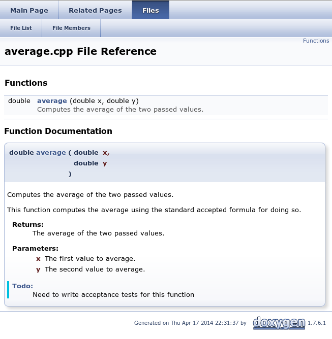
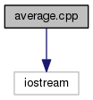
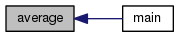
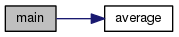

PDR: Doxygen Tutorial
=====================

[Go up to the Tutorials table of contents page](../index.html)

A Mac OS X note: doxygen on a Mac is very hard to install and configure.  It will likely be easier to run doxygen through VirtualBox.  But see the very last paragraph of this lab for Mac-specific details.

Note that the current version of doxygen, as of the writing of this lab (released June 2015, and current as of late 2015), is 1.8.10.  The version currently installing on Ubuntu Linux (both in the lab and on Virtual Box) may be a different version.  These differences should not make any difference for the tags we are using.

A note about line numbers: the line numbers shown throughout this document are for Doxygen version 1.8.6 (not the most recent version!); to find out what version you have installed, run `doxygen -v`.  If it is a different version, then the line numbers will likely change, although they should be somewhat similar.

### Getting Started ###

When writing large amounts of code, it is important to document it, both for your understanding later, as well as for other people's understanding (such as the graders).  So far, all of our documentation has been via regular comments.  However, there exist a number of documentation tools that allow us to do a lot more with our comments.  Consider the Java SDK source code.  If you look at the code itself, there are a lot of comments with special "tags" in the source code.  A tag is a special command that denotes the comment is about some specific aspect, such as the parameter type or return value.  The source code is then run through a program called javadoc (which comes with the Java SDK), and the full online HTML documentation pages that we are familiar with are then created.

Javadoc is great for Java code, but does not work for C++ code.  Thus, we are going to use a program called doxygen, which works on a dozen different languages, including C++.  The homepage for doxygen is [here](http://www.doxygen.org).  A function might be commented as follows.  Note that, like Javadoc, the doxygen comments come *before* the code block to be documented.

```
/** @brief Computes the average of the two passed values.
 *
 * This function computes the average using the standard accepted
 * formula for doing so.
 * @return The average of the two passed values.
 * @param x The first value to average.
 * @param y The second value to average.
 * @todo Need to write acceptance tests for this function
 */

double average (double x, double y) {
  return (x+y)/2.0;
}
```

This is much more documentation than is probably necessary for the `average()` function, but the point is to show the functionality of doxygen.  Note that five of the lines have tags, such as `@return`, which means that the following comment is specifically about the return value.  Some tags, such as the `@param` tag, require a parameter.

Save the above code as a file called [average.cpp](average.cpp.html) ([src](average.cpp)).  There is also a `main()` function in that file that reads in two doubles, calls `average()`, and prints out the result; that function is not commented.

### Creating a Doxyfile ###

We need to tell doxygen what files to process, and a large number of other options.  These are all kept in a file called `Doxyfile`.  To generate that file, run `doxygen -g` (the `-g` means "generate").  Make sure you run this from the same directory that your average.cpp file is in!  This will create a Doxyfile with the default options.  We will need to edit it to set a few things.  The line numbers provided are for version 1.8.6 of Doxygen; if you are using a different version, then your line numbers may vary.

- The `INPUT` option (line 746): put "average.cpp" as the input (put it, without the quotes, after the equals sign).  This tells Doxygen which files to process.
- The `GENERATE_LATEX` option (line 1,543): change "YES" to "NO".  We want HTML output (which is already set to yes), but we don't want LaTeX output.
- The `EXTRACT_ALL` option (line 401): set to "YES".  This will cause Doxygen to create documentation for *all* the members in our file, including our `average()` function.
- The `PAPER_TYPE` option (line 1,586): set to "letter".  We don't use A4 paper size.
- The `GENERATE_RTF` option (line 1,690): set to "YES".  This will generate a rich text format (rtf) version of the documentation, which we can load into our favorite word processor.
- The `OUTPUT_DIRECTORY` option (line 61): set to "doc/".  This will cause all the created files to be in the doc/ sub-directory, and this is *necessary* for us to find your files.
- The `PROJECT_NAME` option (line 35): set to "PDR Lab 11"; note that this is the only option (of the ones we are seeing here) that *should* have double quotes around it.  This creates the appropriate title for the created documentation.
- You may want to set the `QUIET` option (line 686) to "YES"

### Running Doxygen ###

We run doxygen via the `doxygen` command -- no command line parameters are needed (assuming the `Doxyfile` file is in the same directory, which it is in this case).  The configuration file you created above produces documentation in two forms -- HTML and RTF.  With a modification to the configuration file (which we won't see here), it can produce documentation in other formats as well (LaTeX, man pages, XML, etc.).

RTF (rich text format) is a file type that can be loaded up into your favorite word processing program.  Once you have run doxygen, the comments are formatted into a file called `doc/rtf/refman.rtf` -- try loading up that file.  Note that a number of the fields in the file (such as "Title" and "Author") are not yet filled in -- this is addressed below.  If you were to print the documentation, such as a programming reference, then you might use this format.

The other version, and the one we are going to look at, is the HTML documentation.  This is the most convenient for viewing online.  After you run doxygen, these files are in the `doc/html` directory -- view the `doc/html/index.html` file.  If you look at the documentation for this function (from the main page, follow the "Files" link on the title bar, and then the "average.cpp" link), you will see what is below.  Note that there is more to that page than this image; what is below just shows the extracted documentation for `average()`.



Do you see how the tags are separated into the different parts of this comment block?

### Call Graphs ###

Doxygen can create call graphs for your code.  We are going to change three options to "YES": `HAVE_DOT` (line 2,052), `CALL_GRAPH` (line 2,168), and `CALLER_GRAPH` (line 2,179).  The first one turns on graph creation ("dot" is the command-line for the graphviz package); the second and third turn on specific types of graphs.

Now, run `doxygen` again, and view the page describe above (the one that shows the contents of average.cpp).  You will see a few new graphs added.  Keep in mind that, as the input source code (average.cpp) was rather small, these graphs are not going to be particularly all that large, either.

The first graph is a dependency graph:



This shows what the average.cpp file depends on.  Specifically, this is what `#include` lines it has, which is only iostream in this case.

The second graph is a callee graph for `average()`:



This shows that functions and methods call `average()` -- in this case, it's only `main()`.

The third graph is a caller graph for `main()`:



This shows the functions that `main()` calls -- in this case, it's only `average()`.

As the source code gets larger, so do the graphs.  In fact, there is a maximum limit as to how big the graphs are.  Specifically, the `DOT_GRAPH_MAX_NODES` option in the Doxyfile (initial value of 50) limits how many nodes can be represented in a single graph.  In all the three examples shown above, there are only two nodes.  After you start getting toward 100 nodes, the graph starts becoming too large to see on a screen, and it's utility as a visualization tool is lost.

### Continuing Onward ###

To create the documentation for your code (beyond the average.cpp provided), you will need to create the `Doxyfile` file through the process described above.  Note that it's a text file, even though it does not have a .txt extension -- thus, Emacs is a good editor to use to edit the file.  We won't get into most of the details of the file. Be sure to edit the options mentioned above.  Other fields will allow you to specify such things as the title, author, etc. (these are the things that were missing in the RTF file).

Next, look at the doxygen manual.  You can view it in PDF form, but you will first have to download that file (start [here](http://www.stack.nl/~dimitri/doxygen/download.html#dlmanual)).  Otherwise, you can view the [online HTML manual](http://www.stack.nl/~dimitri/doxygen/manual/index.html) -- not surprisingly, this manual was created in Doxygen.  Start with the ["Documenting the code" chapter](http://www.stack.nl/~dimitri/doxygen/manual/docblocks.html), as the previous chapters were covered by the description above.

### Important Notes ###

Private members are not documented in Doxygen by default.  To change this (i.e. to document private members), you will want to change the `EXTRACT_PRIVATE` flag in Doxyfile to `YES`.

You may have to include all of your comments in your .h file.  Whether you have to do this depends on how you structure your code and the code comments.  If you are making changes to your doxygen comments and are not seeing the results, try moving them to the .h file.  As long as the documentation is created when `doxygen` is run, we don't really care where your doxygen comments are in your source code.

To get doxygen working on the Mac, you will have to copy two binaries in /Applications/Doxgyen.app/Contents/Resources/ (or similar) to /usr/bin if you want to run it via the Makefile.  Alternatively, if you have [homebrew](http://brew.sh/) installed on your Mac, you can brew install doxygen from the command line with the command found [here](http://brewformulas.org/Doxygen).
